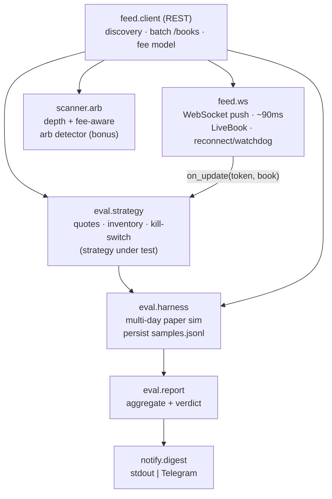

# realtime-md-eval

[](https://github.com/owenzsz/realtime-md-eval/actions/workflows/ci.yml)

**A real-time market-data ingestion + offline strategy-evaluation system**, built on
Polymarket's CLOB as a live data source. It ingests order books over WebSocket at
~90 ms latency, runs 7×24 on a free-tier VM for ~$0/month, and evaluates a market-making
strategy across days of real data to reach a *validate-before-you-build* verdict.

> Engineering / paper-trading project. **No profit claims, no production-at-scale claims.**
> "Trading" is just the problem domain — the interesting parts are the latency, the cost,
> the fault-tolerance, and the evaluation methodology. A single personal VM, not a cluster.

---

## What it is

Three things, cleanly separated:

1. **Ingestion** — an async WebSocket feed that reconstructs each order book in memory and
   pushes updates to consumers, plus a batched REST layer for discovery and snapshots.
2. **Evaluation** — a harness that paper-runs a market-making strategy over many markets
   for days, deliberately modeling adverse selection, and attributes PnL by volatility
   regime to produce a go/no-go verdict.
3. **Operations** — a ~$0/month, self-healing deployment (free-tier VM, IPv6-only, systemd)
   with a daily digest to stdout or Telegram.

## Architecture



<details><summary>ASCII fallback (same graph)</summary>

```
                         feed.client (REST): discovery + batch /books + fee model
                                     |
              ┌──────────────────────┼───────────────────────┐
              ▼                       ▼                        ▼
        feed.ws  ── on_update ──▶ eval.strategy          scanner.arb
        (WS, ~90ms)              (quotes/inventory/        (arb detector,
        LiveBook                  kill-switch)              bonus tool)
                                       │
                                       ▼
                                 eval.harness  (multi-day paper sim, samples.jsonl)
                                       │
                                       ▼
                                 eval.report ──▶ notify.digest (stdout | Telegram)
```
</details>

Dependencies point inward toward `feed.client` (the single source of truth for HTTP, the
fee model, categorization, and book normalization). The graph is acyclic. See
[docs/DESIGN.md](docs/DESIGN.md) for the reasoning.

## Engineering highlights

- **~90 ms order-book updates over WebSocket — ~100× fresher than 10 s REST polling.**
  In-memory `LiveBook` rebuilds on snapshot, applies absolute-size level deltas, and a
  watchdog forces a reconnect after 120 s of silence (the channel has no sequence numbers).
- **~$0/month, 7×24.** GCP free-tier `e2-micro`, **IPv6-only** (no external IPv4 → avoids
  the ~$3/mo charge), **IAP-tunneled** SSH (no public port), **`systemd Restart=always`**
  self-healing with daily sessions that prune resolved markets and top back up.
- **1 request per polling round.** All tracked books are fetched in a single batched
  `POST /books`, keeping egress under the 1 GB/mo free cap.
- **Evaluation that models adverse selection.** Paper fills trigger only on the adverse
  move; PnL is attributed by price-volatility regime; a single pure verdict function emits
  `insufficient | thin | positive | negative`.
- **Clean, tested package.** Pure logic split from I/O; a `pytest` suite covers the book
  state machine, quoting/inventory/fill math, the fee curve, the depth walk, and the
  verdict aggregation.

## Quickstart

```bash
pip install -r requirements.txt && pip install -e .

# 1) Watch a live order book (prints top-of-book moves + age in ms)
python examples/run_feed.py --seconds 25 --markets 6

# 2) Run a short paper-evaluation session, then print the verdict
python examples/run_eval.py --loops 30 --interval 5 --markets 6

# 3) Scan for depth- and fee-verified structural arbitrage (bonus tool)
python examples/run_scanner.py --pages 3 --min-net 0.3

# run the tests
pip install -r requirements-dev.txt && pytest
```

Everything is keyless and read-only by default. Live order placement is optional, off by
default, and behind an explicit confirmation (`pip install -e ".[live]"`).

## Package layout

```
rtmde/
  config.py            layered config (defaults <- config.yaml); secrets via env only
  feed/client.py       REST discovery, batch /books, fee model, categorization
  feed/ws.py           async WebSocket feed + LiveBook
  eval/strategy.py     the market-making strategy under test (quotes/inventory/fills)
  eval/harness.py      multi-day paper-eval collector
  eval/report.py       pure aggregation + go/no-go verdict
  scanner/arb.py       depth + fee-aware structural-arb detector (bonus)
  notify/digest.py     stdout | Telegram digest
deploy/                free-tier VM units + ops script (placeholdered, no secrets)
docs/                  DESIGN.md + research note
examples/              runnable entry points
tests/                 pytest suite (pure logic)
```

## What the data showed

The eval harness ran across several markets and produced a clear, useful result:

- **Naive market-making is net-negative on news-driven markets** — adverse selection
  (getting filled on the side the market is about to move against) overwhelms the liquidity
  reward when the price is moving.
- **It is net-positive on slow, low-competition markets** — where the reward is earned
  quietly and inventory barely moves.
- The **US–Iran ceasefire spike (2026-06-14)** was captured live and is the textbook case:
  during the move, simulated inventory losses wiped out the projected reward — exactly the
  failure mode the volatility-bucketed attribution is designed to expose.

The takeaway is a methodology point, not a trading tip: **the right move was to measure
this cheaply for days and let the data say "not yet" before building a low-latency executor
or risking capital.** The fact that riskless arbitrage is essentially gone for a slow
individual (0 actionable edges across 8,247 live books after depth + fees) is written up in
[docs/research/strategy-analysis.md](docs/research/strategy-analysis.md).

## Deployment

See [deploy/README.md](deploy/README.md) for the full ~$0/month free-tier setup (IPv6-only
VM, IAP SSH, systemd service + daily digest timer, ops script).

## License

MIT — see [LICENSE](LICENSE).
